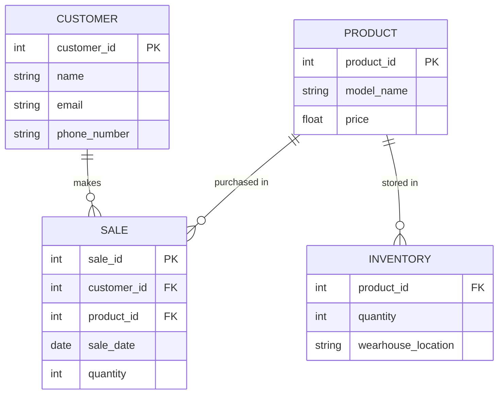

# Nike Store ERD 

## Entity Description 
-**PRODUCT** represents the model of the shoes, their product ID and price. 
-**CUSTOMER** represents the person buying the shoes as well as their name, email, phone number, and a customer ID. 
-**SALE** represents the data involved in the sale such as sale ID, quantity purhcased, and sale date. In addition, it includes the customer ID and product ID.
-**Inventory** represents the stock of each product. This is done by using the product ID and checking the quantity and wearhouse location. 
## Relationship Description 
-**Customer to sale** This relationship is a one to many relationship. This is because a single customer can make many purchases so each sale record has a foreign key to the customer.
-**Product to sale** This relationship is a one to many relationship. This is because a product can be part of many sales, this allows the store to track.
-**Product to invnetory** This relationship is a one to one/many relationship. This is because each product has one or more in inventory. This allows the stoe to track how many of each product is in stock and where they are. 
## Significance of Relationship

 
