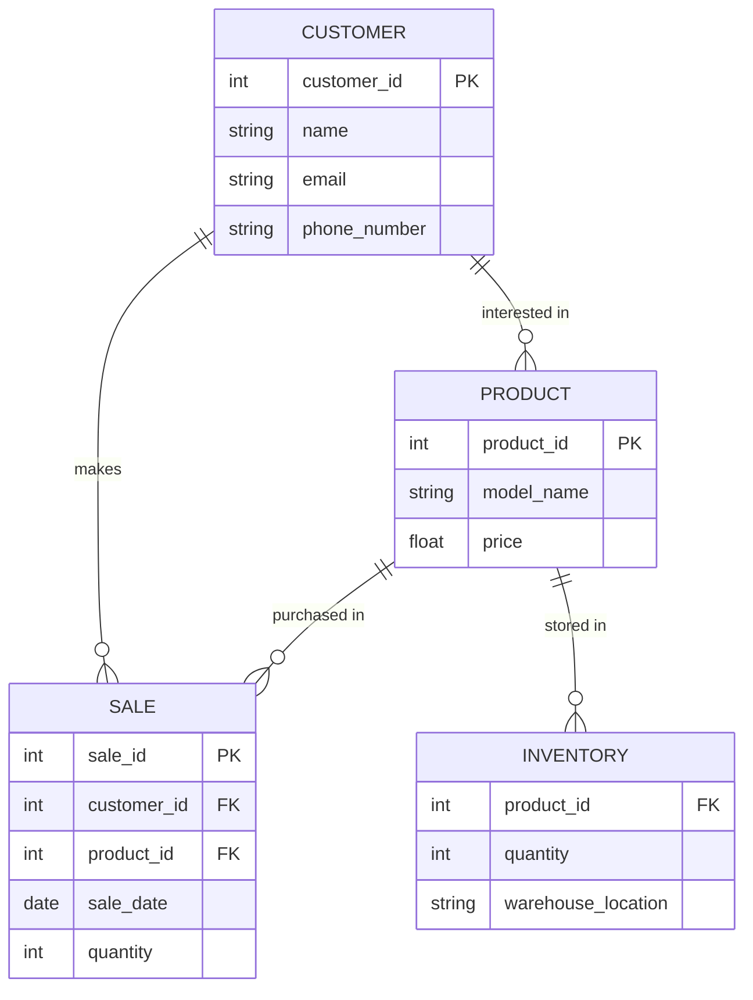

# Nike Store ERD 

## Entity Description 
-**PRODUCT** represents the model of the shoes, their product ID, and price. 

-**CUSTOMER** represents the person buying the shoes and their name, email, phone number, and customer ID. 

-**SALE** represents the data involved in the sale such as sale ID, quantity purchased, and sale date. In addition, it includes the customer ID and product ID.

-**Inventory** represents the stock of each product. This is done using the product ID and checking the quantity and warehouse location. 

## Relationship Description 
-**Customer to sale** This relationship is a one-to-many relationship. This is because a single customer can make many purchases so each sale record has a foreign key to the customer.

-**Product to sale** This relationship is a one-to-many relationship. This is because a product can be part of many sales, which allows the store to track.

-**Product to inventory** This relationship is a one-to-one/many relationships. This is because each product has one or more in inventory. This allows the store to track how many of each product are in stock and where they are. 

-**Customer to product** This relationship is a many-to-many relationship. This is because many customers could have many different products that they are interested in and like. This allows the store to identify which products customers like.

## Significance of Relationship

-**Customer to sale** This relationship is important since it allows the store to see which customers are making purchases. This is done by linking each sale to a specific customer. It can help the store get data on preferences and purchase history to see what items customers like. 

-**Product to sale** This relationship is crucial since it allows the store to track the demand for each shoe. This allows the store to find out which shoes have high demand and predict future demand

-**Product to inventory** This relationship is important since it helps the store manage its inventory efficiently. This allows the store to keep track of inventory and reorder the products that are selling well. 

-**Customer to product** This relationship is important since it helps the store identify which products the customers like the most. This allows the store to make new products tailored to the interests of their customers. Additionally, it can help the stores with marketing since they know which products to advertise more.
